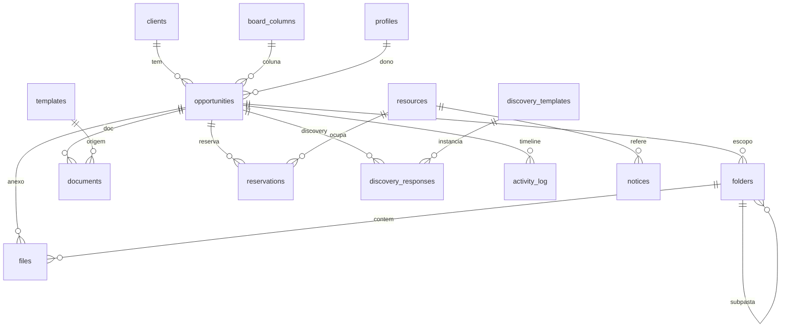

# PLAN.md — Uplink

> Cockpit de pré-vendas técnica. Tudo orbita uma **Oportunidade** (cliente + demanda técnica).
> Este documento é o contrato de arquitetura. Nada de código de produção antes da aprovação (Aprovação 0).

---

## 1. Visão e princípio unificador

O Uplink não é três módulos com um menu em comum. É **um sistema onde o contexto atravessa os módulos**. A entidade central é a `oportunidade`. Ao abri-la, o engenheiro vê numa única tela: arquivos/diagramas, o card do Kanban (a própria oportunidade), reservas de laboratório, discovery notes e a linha do tempo de atividade — tudo daquele cliente/demanda.

O mecanismo que garante isso é o **trilho de contexto** (painel direito persistente nas telas de oportunidade) alimentado por `opportunity_id`, presente como FK em quase toda tabela do domínio.

---

## 2. Princípios de arquitetura (inegociáveis)

1. **Back-end mínimo.** Postgres + Auth + Storage + Realtime do Supabase. Sem servidor Node de CRUD.
2. **Regra de acesso vive no banco (RLS).** O front nunca é a fronteira de segurança.
3. **Regra de negócio crítica vive no banco.** Não-sobreposição de reserva = `EXCLUDE USING gist`. Timeline = triggers em `activity_log`. Busca = triggers em `search_index`. Vencimentos = `pg_cron` + função SQL. Edge Function só se for indispensável — e não é.
4. **Feature-based no front.** Cada `feature/` é autocontida. **Nenhum componente chama o Supabase direto** — sempre via hook da feature (TanStack Query). Isso mantém a porta aberta para o Anexo A (migrar para Fastify) sem tocar na UI.
5. **Migrations versionadas.** Zero alteração manual pelo painel. Types gerados do banco.

---

## 3. Decisões de setup (confirmadas com o usuário)

| Área | Decisão |
|---|---|
| Banco em dev | **Local via Docker** (`supabase start`). Migrations + seed versionados. |
| Banco em deploy | **Nuvem**, provisionada só na Fase 6. Migrations portáveis (mesmos arquivos). |
| Cadência | **Autônomo com 2 checkpoints**: (A) antes de aplicar RLS/Storage na Fase 2; (B) antes de qualquer publicação real na Fase 6. |
| Acesso/seed | **Usuários demo prontos** (admin + engenheiros, credenciais no README). Cadastro aberto em dev. |
| Deploy | **Deploy-ready + documentado.** Publicação só sob pedido. |
| `linter de segurança` | Local: `supabase db lint` + advisors do Studio local. Na nuvem (Fase 6): `get_advisors` via MCP. |

Detalhes e refinamentos em `DECISIONS.md`.

---

## 4. Stack (exata)

**Front:** React 19 · Vite · TypeScript strict · Tailwind v4 (`@tailwindcss/vite` + `@import "tailwindcss"` + `@theme`, **sem `tailwind.config.js`**) · shadcn/ui (Radix) · lucide-react · TanStack Query · React Router v7 (data router) · react-hook-form + zod · @dnd-kit · date-fns + date-fns-tz (`pt-BR`, fuso `America/Sao_Paulo`) · Recharts · @react-pdf/renderer · sonner · Fontsource (Space Grotesk, Inter, JetBrains Mono — sem CDN).

**Back:** Supabase (Postgres 15 + Auth + Storage + RLS + Realtime). Extensões: `pgcrypto`, `btree_gist`, `unaccent`, `pg_cron`. CLI como devDependency (`npx supabase`).

**Qualidade:** ESLint + Prettier · Vitest · Playwright.

---

## 5. Estrutura de pastas

```
src/
  app/          providers, router (data router), layout raiz, error boundary, tema
  features/
    auth/  opportunities/  workspace/  board/  lab/  discovery/  search/  dashboard/
  components/ui/       shadcn (não misturar com features)
  components/shared/   EmptyState, ErrorState, DataTable, PageHeader, StatusPill, FaixaOcupacao...
  hooks/  lib/ (supabase.ts, formatters, cn, constantes, tz)  types/ (database.ts gerado)
supabase/
  migrations/   seed.sql   functions/ (só se indispensável)
tests/  e2e/ (playwright)   unit via *.test.ts colocalizado
```

Cada `feature/`: `components/`, `hooks/` (queries+mutations), `schemas.ts` (zod), `types.ts`.

---

## 6. Modelo de dados

Convenções em todas as tabelas: `id uuid default gen_random_uuid()`, `created_at timestamptz default now()`, `updated_at timestamptz` (via trigger), `RLS ENABLED`. Soft-delete (`deleted_at`) apenas onde o brief exige: `folders`, `files` (lixeira 30 dias).

### 6.1 Enums

```
role                 admin | engenheiro | leitor
folder_visibility    private | team
prioridade           baixa | media | alta | critica
resource_tipo        licenca | servidor_lab | porta_switch | conta_demo | credito_nuvem | equipamento
resource_status      disponivel | manutencao | baixado
reservation_status   ativa | concluida | cancelada
notice_tipo          aviso | manutencao | vencimento | incidente
template_tipo        rfp | poc | proposta | topologia
discovery_status     rascunho | finalizado
```

### 6.2 Tabelas (esboço → definitivo)

```
profiles          id=auth.users.id, nome, email(unique), avatar_url, cargo, squad,
                  role role default 'engenheiro'
                  -- bootstrap: trigger handle_new_user em auth.users
                  -- guard: trigger impede não-admin de mudar role

clients           nome, segmento, logo_url, owner_id→profiles

board_columns     nome, position numeric, cor, wip_limit           [REFINAMENTO]
                  -- colunas "configuráveis" ⇒ tabela, não enum de stage
opportunities     client_id→clients, titulo, descricao,
                  column_id→board_columns, prioridade, owner_id→profiles,
                  due_date date, position numeric, tags text[]
                  -- position fracionário (midpoint) p/ dnd sem reindex em massa
                  -- ESTA é o card do Kanban. Não há entidade "card" separada.

folders           owner_id→profiles, parent_id→folders(self), nome,
                  visibility folder_visibility default 'private',
                  opportunity_id→opportunities(null), deleted_at
files             folder_id→folders, opportunity_id(null), nome, storage_path,
                  mime, size_bytes bigint, versao int, replaces_file_id→files(null),
                  is_current bool default true, uploader_id→profiles, tags text[], deleted_at
                  -- versão: nova linha, versao+1, replaces_file_id=anterior,
                  --         anterior.is_current=false. Feito por RPC atômica.

templates         tipo template_tipo, titulo, conteudo_md, tags text[], versao,
                  author_id→profiles, is_published bool
documents         opportunity_id→opportunities, source_template_id→templates(null),
                  titulo, conteudo_md, author_id→profiles                 [REFINAMENTO]
                  -- "Usar este template" cria uma cópia editável AQUI, dentro da oportunidade

resources         tipo resource_tipo, nome, descricao, status resource_status,
                  metadata jsonb default '{}', expira_em date(null), responsavel_id→profiles(null)
reservations      resource_id→resources, user_id→profiles, opportunity_id→opportunities(null),
                  periodo tstzrange, finalidade, status reservation_status default 'ativa'
                  -- CHECK: periodo não vazio e limitado
                  -- EXCLUDE USING gist (resource_id WITH =, periodo WITH &&)
                  --   WHERE (status <> 'cancelada')     ← exige btree_gist
notices           author_id→profiles, tipo notice_tipo, corpo, pinned bool,
                  resource_id→resources(null), expires_at timestamptz(null)
                  -- expira: queries filtram expires_at IS NULL OR > now()

discovery_templates  nome, descricao, schema jsonb, versao, is_active bool
discovery_responses  template_id→discovery_templates, template_versao int,
                     opportunity_id→opportunities, engineer_id→profiles,
                     answers jsonb, status discovery_status default 'rascunho',
                     completude int, resumo_md, finalizado_em

activity_log      actor_id→profiles, entity_type, entity_id, opportunity_id(null),
                  acao, payload jsonb, created_at   -- append-only, alimentado por trigger
search_index      entity_type, entity_id, opportunity_id(null), titulo, corpo,
                  tsv tsvector, owner_id(null), visibility(null)          [REFINAMENTO]
                  -- UNIQUE(entity_type, entity_id), GIN(tsv)
                  -- tsv mantido por TRIGGER (evita problema de imutabilidade do unaccent)
                  -- owner_id/visibility ⇒ RLS não vaza arquivo privado na busca
```

### 6.3 Relações centrais



### 6.4 Triggers e funções (a regra no banco)

- `set_updated_at()` — BEFORE UPDATE em toda tabela com `updated_at`.
- `handle_new_user()` — AFTER INSERT em `auth.users` → cria `profiles` (SECURITY DEFINER).
- `guard_profile_role()` — BEFORE UPDATE em `profiles`: só admin altera `role`.
- `log_activity()` — AFTER INSERT/UPDATE em opportunities, files, documents, reservations, notices, discovery_responses → `activity_log` (SECURITY DEFINER; cliente não escreve direto).
- `sync_search_index()` — AFTER INSERT/UPDATE/DELETE em opportunities, files, templates, documents, discovery_responses, notices → upsert/delete em `search_index`, computando `tsv = to_tsvector('portuguese', unaccent(titulo||' '||corpo))` e copiando owner_id/visibility.
- `gerar_avisos_vencimento()` — função SQL agendada por **pg_cron** (diária): cria `notices` tipo `vencimento` para `resources` com `expira_em` em ≤7 dias (idempotente). Badge do dashboard é query ao vivo (não depende do job).

### 6.5 RPCs (Postgres functions) para atomicidade

- `criar_versao_arquivo(...)` — insere nova versão, vira `is_current`, desmarca a anterior.
- `usar_template(template_id, opportunity_id)` — cria `documents` a partir do template.
- `reordenar_oportunidade(opp_id, column_id, antes_id, depois_id)` — calcula `position` (midpoint).
- `finalizar_discovery(response_id)` — valida completude, gera `resumo_md`, seta `finalizado`.
- `buscar(q, filtro_cliente, filtro_engenheiro, periodo)` — full-text + `ts_headline` (trecho destacado), respeitando RLS.

### 6.6 Storage

- Bucket **`files`** (privado). Path: `{folder_id}/{file_id}/{versao}__{nome}`. Policies espelham `files` (join por `storage_path`). Download por **signed URL** de expiração curta.
- Bucket **`avatars`** (público, baixa sensibilidade).

---

## 7. Segurança (RLS)

Helper: `public.is_admin()` (STABLE, SECURITY DEFINER) → `exists(select 1 from profiles where id=auth.uid() and role='admin')`.

| Tabela | Leitura | Escrita |
|---|---|---|
| `folders`, `files` | dono **OU** `visibility='team'` (e `deleted_at IS NULL`) | dono ou admin |
| `opportunities`, `clients`, `board_columns` | qualquer autenticado | dono ou admin (colunas: admin) |
| `templates` | published **OU** autor **OU** admin | autor ou admin |
| `documents` | qualquer autenticado (segue a oportunidade) | autor ou admin |
| `resources` | qualquer autenticado | admin |
| `reservations` | qualquer autenticado | dono da reserva ou admin |
| `notices` | qualquer autenticado | autor ou admin |
| `discovery_templates` | qualquer autenticado | admin |
| `discovery_responses` | qualquer autenticado | engenheiro responsável ou admin |
| `activity_log` | qualquer autenticado | ninguém direto (só triggers) |
| `search_index` | `visibility='team'` OU `owner_id=auth.uid()` OU escopo público | ninguém direto (só triggers) |

- `service_role` **nunca** vai ao front. Só `anon key` (pública por design).
- **Teste real de isolamento** (gate da Fase 2): usuário B não lê pasta privada de A, nem por query direta, nem pela busca global.

---

## 8. Camadas transversais

- **Command palette `⌘K`/`Ctrl+K`** — shadcn `Command`: ações (criar oportunidade, reservar recurso, abrir discovery, ir para cliente) + resultados de busca.
- **Busca global** — RPC `buscar()`, um índice, resultados agrupados por tipo, filtro por cliente/engenheiro/período, trecho destacado com `ts_headline`. Acentuação indiferente (`unaccent`).
- **Trilho de contexto** — painel direito nas telas de oportunidade: arquivos, reservas, discoveries, documentos, atividade recente.
- **Linha do tempo** — leitura de `activity_log` por `opportunity_id`.
- **Dashboard** — visão do dia: meus cards por coluna, minhas reservas de hoje, discoveries incompletos, prazos vencendo (≤3 dias), recursos vencendo (≤7 dias), últimos recados. Recharts em 1–2 visões.

---

## 9. Fases de execução

> `[APROVAÇÃO 0]` — **AGORA**: aprovar `PLAN.md` + `DESIGN.md` antes de qualquer código de produção.
> Ao fim de cada fase: `typecheck` + `lint` + `build` verdes, commit convencional, resumo em `PROGRESS.md`.

**Fase 0 — Fundação.** `git init`; scaffold Vite+React+TS strict; Tailwind v4 (@theme, sem config); shadcn/ui; ESLint/Prettier; estrutura de pastas; `lib/supabase.ts`; `supabase init` + `supabase start`; tokens e componentes base (Button, Input, Card, StatusPill, EmptyState, ErrorState, PageHeader, DataTable, **FaixaOcupacao**); `.env.example`; README esqueleto; **página de estilo** demonstrando tokens + componentes.
*Pronto quando:* `npm run build` passa e a página de estilo existe.

**Fase 1 — Auth e shell.** Login e-mail/senha; cadastro de perfil; proteção de rotas; layout raiz (topbar + sidebar colapsável + conteúdo + trilho); tema claro/escuro persistido; sessão expirada tratada.
*Pronto quando:* entra, sai, recarrega mantendo sessão; rota privada redireciona.

`>>> [CHECKPOINT A] — apresento o desenho de RLS + Storage para sua aprovação antes de aplicar.`

**Fase 2 — Núcleo do domínio + Workspace.** Migrations com RLS de profiles, clients, board_columns, opportunities, folders, files, templates, documents; Storage + policies; CRUD de clientes e oportunidades; tela da oportunidade com trilho; árvore de pastas (privada/time); upload (drag&drop, progresso real, preview, versionamento, tags); biblioteca de templates (editor+preview Markdown, "Usar este template").
*Pronto quando:* linter de segurança sem avisos **e** teste real: usuário B não lê pasta privada de A.

**Fase 3 — Kanban.** Colunas configuráveis; dnd-kit com atualização otimista + persistência de ordem; filtros (responsável, cliente, prioridade, prazo); destaque de prazo vencido.
*Pronto quando:* arrastar → recarregar mantém posição; falha de rede reverte o card.

**Fase 4 — Lab & Recursos.** Migrations de resources, reservations (com EXCLUDE), notices; inventário; calendário semana/mês; criar/reagendar reserva (otimista); painel "meus recursos"; mural (fixar, expirar); vencimento automático (pg_cron); **faixa de ocupação** nas 3 densidades.
*Pronto quando:* reserva sobreposta é bloqueada **pelo banco** e a UI mostra o conflito (quem reservou e até quando).

**Fase 5 — Discovery.** Migrations de discovery_templates/responses; renderizador dirigido por schema; lógica condicional; autosave 2s c/ indicador; barra de completude; **3 templates seed** (SD-WAN, Última Milha, Observabilidade+Segurança) com perguntas reais; gerador de resumo (pendências/riscos); exportação PDF (`@react-pdf/renderer`, no cliente); listagem por cliente/engenheiro.
*Pronto quando:* discovery completo vira PDF legível e o resumo destaca pendências.

**Fase 6 — Busca, dashboard, acabamento.** search_index por trigger; busca global c/ trecho; command palette; dashboard; timeline via activity_log; E2E Playwright (3 fluxos); revisão de acessibilidade; README completo.
*Pronto quando:* buscar termo escrito dentro de um discovery encontra o registro; os 3 fluxos passam.

`>>> [CHECKPOINT B] — deploy-ready. NÃO publico sem sua ordem. Se pedir: provisiono Supabase nuvem, aplico migrations/seed, get_advisors, deploy Vercel.`

---

## 10. Testes

**Vitest (regra de negócio pura):** overlap de intervalo (`intervalosSobrepoem`), cálculo de completude, avaliação de lógica condicional do discovery, geração do resumo.
**Integração (banco):** insert de reserva sobreposta deve falhar (constraint EXCLUDE).
**Playwright (3 fluxos):** (1) login → criar oportunidade → anexar arquivo; (2) reservar com conflito → bloqueio claro; (3) preencher discovery → resumo → PDF.
Sem perseguir cobertura total.

---

## 11. Riscos e mitigação

| Risco | Mitigação |
|---|---|
| shadcn/ui em Tailwind v4 (muitos snippets são v3) | usar CLI compatível com v4; tokens via `@theme`/CSS vars; `components.json` sem config JS; validar cada componente base na Fase 0 |
| `unaccent` não-imutável em coluna gerada | `tsv` mantido por **trigger**, não generated column |
| `btree_gist`/`tstzrange` no Postgres local | `create extension btree_gist`; imagem `supabase/postgres` já suporta |
| Fontes no `@react-pdf/renderer` (sem CDN) | registrar TTF via Fontsource local (`Font.register`) |
| Fuso `America/Sao_Paulo` | armazenar `timestamptz` (UTC); interpretar/renderizar com `date-fns-tz` |
| Seed de usuários auth em local | `seed.sql` insere em `auth.users` com `crypt()` (pgcrypto) — determinístico |
| `pg_cron` indisponível em algum ambiente | badge do dashboard é query ao vivo; função de vencimento também chamável manualmente |
| Storage RLS por join de path | policies testadas com 2 usuários (mesmo gate do isolamento) |

---

## 12. Entregáveis (checklist)

App completo · `supabase/migrations/` · `supabase/seed.sql` (5 clientes, 8 oportunidades no Kanban, 12 recursos variados, reservas por 2 semanas, 6 recados, 3 templates de discovery, 2 discoveries preenchidos, usuários demo) · `README.md` · `DESIGN.md` · `DECISIONS.md` · `PROGRESS.md` · `IDEAS.md` · `.env.example` · testes Vitest + Playwright.

---

## 13. Critérios de aceite (do brief)

- [ ] ≤3 cliques do dashboard a qualquer arquivo/reserva/discovery de uma oportunidade.
- [ ] Pasta privada invisível aos demais; pasta do time legível por todos, editável só pelo dono.
- [ ] Reserva conflitante impossível — bloqueada pelo banco.
- [ ] Discovery → resumo + PDF sem serviço externo.
- [ ] Busca global acha conteúdo em discoveries/arquivos/templates/recados, acento indiferente.
- [ ] Toda tela com carregando/vazio/erro.
- [ ] Contraste AA, teclado completo, foco sempre visível.
- [ ] `typecheck && lint && build && test` limpo.
- [ ] Dev novo roda o projeto só com o README.
